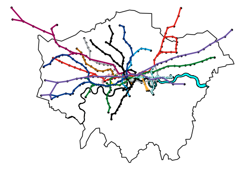

# tube
🚇 Data science on underground data.

## Project ideas
- [ ] Represent as graph flow problem - source data on station entrances and exits, routes, etc.
      Could this be something akin to this [Boris Bike pattern analysis](https://alan-turing-institute.github.io/TuringDataStories/stories/2022-10-06-Boris-Bikes/2023-07-07-Boris-Bikes.html)?
- [ ] Analyse bottlenecks, regions with poor connectivity, etc. Evaluate proposals of new lines / stations for effect on this.
- [ ] Real time - replicate [https://traintimes.org.uk/map/tube/](https://traintimes.org.uk/map/tube/)?
- [ ] When do anomylous usage figures occur? Can we correlate this with reasons, e.g. sporting events, etc.
- [ ] Map analysis - i.e. how close is geographical map to harry beck's?
- [ ] ???

## Possible data sources
- [Transport for London Unified API ](https://api.tfl.gov.uk/)
- [TfL Open Data](https://tfl.gov.uk/info-for/open-data-users/our-open-data)
  - https://crowding.data.tfl.gov.uk/
- [2017 customer flow dataset](https://blog.tfl.gov.uk/2017/03/09/new-tube-customer-volumes-and-movements-data/)
- [TfL Network Demand Dashboard](https://app.powerbi.com/view?r=eyJrIjoiZDgwZWY4NWMtZTFkMi00YzM2LThiMWQtNzg2ZTc2YjliNzM2IiwidCI6IjFmYmQ2NWJmLTVkZWYtNGVlYS1hNjkyLWEwODljMjU1MzQ2YiIsImMiOjh9)
